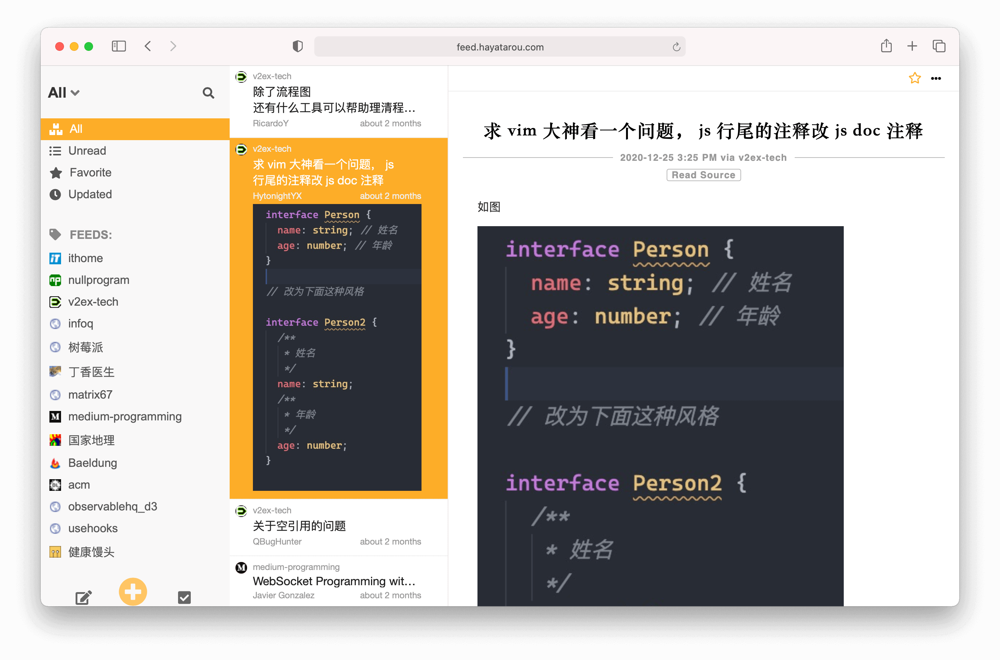

<div align="center">
  
  <br>
  <a href="https://github.com/facebook/jest"></a><a href="https://opensource.org/licenses/MIT"></a>
</div>
<p align="center"><code>jpmonette/feed</code> - <strong>RSS 2.0, JSON Feed 1.0, and Atom 1.0</strong> generator for <strong>Node.js</strong><br>
Making content syndication simple and intuitive!</p>




## APP

## Deploy

``` bash
docker-compose up
```

### create user

example to create new user foo/password

```bash
docker-compose exec server /bin/bash
```

``` bash
./node_modules/.bin/ts-node src/tool/create-user.ts foo password
```

## config
default config in `config/config.yaml`, it store in git, please do not motifiy it.

you can change config in `config/config.custom.yaml`, it will override `config/config.yaml`

otherwise, you can change config in env variables, it will override 

| Name                  | Description                    | Default |
|-----------------------|--------------------------------|---------|
| VAPID_DETAIL_EMAIL    | vapid detail email             |         |


### Log
log file write to ./log dir


## Docker

### login into postgres container

``` bash
docker exec -it [container name]  sudo -u postgres psql
```

``` bash
su - postgres && psql
```

## Proxy (Experimental)
just set `HTTP_PROXY` and `HTTPS_PROXY`env in shell (linux or mac).
Or set `proxy_url` in `config.yaml`

